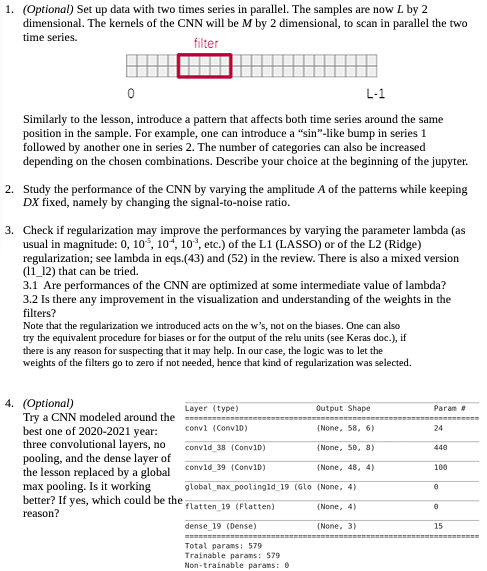

# CompLabB-UNIPD-TeamDream
This repository was created for the collaboration of our group in the completion of the Laboratory of Computational Physics Class in year 1 semester 2 of the Physics of Data Masters degree in UNIPD. It focuses on the practical development of machine learning techniques.
# Tasks EX3 Assignment (Due :27/03/2022)
Daniel & Marco: 2
Jake & Theivan: 3

